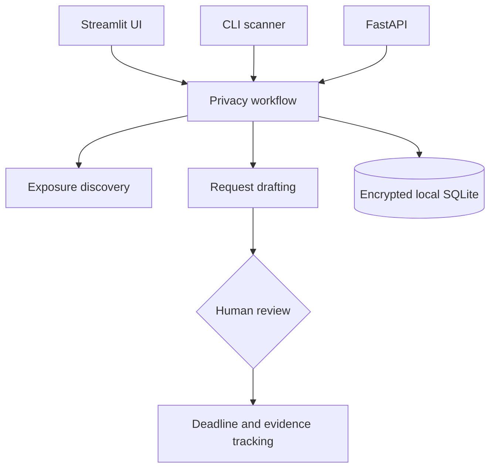

# Non-Pursuit

Non-Pursuit is a local-first privacy workflow for discovering public exposure,
drafting deletion requests, recording evidence, and tracking response deadlines.
Personal data stays on the operator's machine; generated requests always require
human review before submission.

## Highlights

- Streamlit dashboard and command-line scanner
- FastAPI surface for discovery and remediation workflows
- Fernet encryption for locally stored personal data
- Jurisdiction-aware request templates
- Evidence hashing and deadline tracking
- Human approval gates for legal correspondence and browser automation
- Offline-first tests with third-party network calls mocked

## Architecture



The project intentionally contains no autonomous send path. Scans, drafts, and
browser-assisted steps produce reviewable artifacts; the user decides what is
submitted.

## Quick start

Requires Python 3.12 and Google Chrome for optional Playwright-assisted flows.

```bash
python3 -m venv .venv
source .venv/bin/activate
python -m pip install --upgrade pip
pip install -r requirements.txt
cp .env.example .env
streamlit run app.py
```

Demo mode uses synthetic data and temporary per-session storage:

```bash
NON_PURSUIT_DEMO_MODE=1 streamlit run app.py
```

## CLI

```bash
python main.py --username example_handle --max-sites 100
python main.py --domain example.com
python main.py --agent-stats
```

## API

```bash
uvicorn api.main:app --host 127.0.0.1 --port 8000
```

The separate Streamlit API client can then run with:

```bash
streamlit run frontend/app.py
```

## Tests

```bash
pip install -r requirements-dev.txt
pytest tests/ -q
```

The suite contains 1,088 collected cases covering encryption, deadline math,
request rendering, runtime isolation, API behavior, and UI wiring.

## Repository boundaries

This repository contains source code, tests, small public reference datasets,
and derived brand assets only. It excludes virtual environments, credentials,
runtime databases, logs, evidence captures, recovery material, and personal
data. See [Safety boundaries](docs/SAFETY_BOUNDARIES.md) for the controls that
must remain human-reviewed.

## Disclaimer

Non-Pursuit is an engineering portfolio project, not legal advice or a filing
service. Users must verify generated correspondence, deadlines, and applicable
law before acting.
