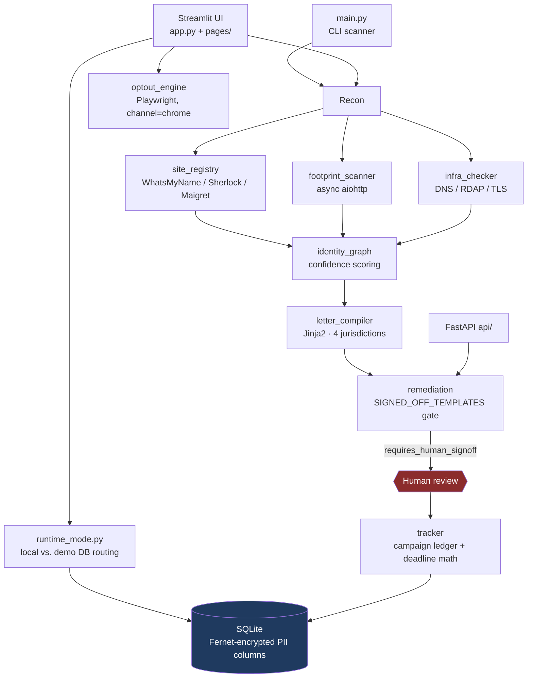

# Non-Pursuit

A local-first privacy enforcement engine. It finds where your personal data is
exposed, drafts the statutory deletion demand for the right jurisdiction, and
tracks the response deadline the law gives that recipient — without your PII
ever leaving your machine.

Python 3.12 · Streamlit · SQLite · FastAPI · Playwright · 1,088 tests in CI

---

## Why it exists

Consumer privacy tools are mostly SaaS: you hand a company your name, address,
email, and date of birth so it can ask data brokers to delete your name,
address, email, and date of birth. The remedy has the same shape as the
problem.

Non-Pursuit runs on the user's hardware. PII is encrypted at rest in a local
SQLite file, the recon runs from the user's own network, and no identity data
is transmitted to any service this project controls — because there is no
service this project controls.

---

## Architecture



Nothing in this system transmits a demand on its own. The path from a generated
payload to a sent letter runs through a human, by design — see below.

---

## Engineering decisions worth reading

### 1. The sign-off gate: an autonomous agent that is not allowed to send

Most of this codebase was written by an AI agent. Statutory deadline math and
legal correspondence are not places to trust generated code, so the agent's
output is fenced rather than reviewed after the fact.

`utils/remediation.py` compiles a demand payload and stamps it with
`requires_human_signoff` unless its template appears in `SIGNED_OFF_TEMPLATES`
— a set a human edits by hand after reading the rendered letter. A template
cannot mark itself approved. `api/main.py:538` enforces the same flag on the
FastAPI surface, and there is **no send path anywhere in the repository**: no
`smtplib`, no outbound `POST` of a compiled demand. The last step is a person.

### 2. Quarantining a duplicate implementation instead of deleting it

The campaign tracker's deadline math is designated a Human Validation Zone in
`CLAUDE.md`: the day-45 boundary convention (day 45 compliant, day 46 overdue)
was checked by hand against CCPA § 1798.130(a)(2) and signed off manually.

A second deadline implementation later appeared in
`remediation.deadline_for()`. Its arithmetic was correct, so tests would not
have flagged it — the risk wasn't wrongness, it was *drift*: two independently
derived deadlines for the same campaign, diverging the first time either one
changed. It was kept as display-only, wired deliberately to nothing, with the
reason recorded at the definition (`utils/remediation.py:102`):

> *"a second, differently-derived deadline reaching the ledger is exactly the
> drift that convention exists to prevent."*

### 3. Demo-mode isolation, or how a second database file would have leaked visitor data

The hosted demo serves many visitors from one process. Every store routes
through `runtime_mode.db_path()`, which returns the durable database locally
and a **per-visitor temp file** in demo mode, created once per Streamlit
session and held in `session_state`.

The original spec put the broker campaign ledger in its own `campaigns.db`.
Hardcoding that second path would have bypassed the accessor — and handed one
demo visitor's campaign records to the next. The ledger became a table inside
the existing `tracker.db` instead. One accessor, one routing decision, no
second path to keep in sync.

### 4. A hardcoded salt is not a salt

The Fernet key protecting PII columns can be derived from a master password
(PBKDF2-HMAC-SHA256, 480k iterations), ported from a predecessor project that
used `salt = b'data_broker_agent_v1'` — the same salt on every install, which
is precisely what a salt exists to prevent. This generates 16 random bytes per
install and stores them next to the database: a salt needs to be unique and
durable, not secret. The vault is an overlay on the `.env` key rather than a
replacement, because swapping the cipher outright would strand every record
already encrypted under the old one.

Related, in `utils/admin_auth.py`: the admin dashboard compares secrets with
`hmac.compare_digest` over SHA-256 digests, and when no key is configured the
page is removed from navigation entirely rather than rendered as a prompt that
can never be satisfied — an unsatisfiable login form advertises the page to
everyone who can see the sidebar.

---

## Quick start

```bash
git clone https://github.com/madfrantic/non-pursuit.git
cd non-pursuit

python3.12 -m venv venv && source venv/bin/activate
pip install -r requirements.txt

streamlit run app.py
```

The database and encryption key are created on first run. Playwright drives an
existing Google Chrome install (`channel="chrome"`), so `playwright install` is
not required — but Chrome must be present for the automated opt-out flows.

**CLI, without the UI:**

```bash
python main.py --username <handle> --max-sites 100
python main.py --domain example.com          # DNS / RDAP / TLS
python main.py --agent-stats                 # broker ledger counts
```

**Hosted demo build** — synthetic data, per-visitor throwaway database:

```bash
NON_PURSUIT_DEMO_MODE=1 streamlit run app.py
```

---

## Tests

```bash
pytest tests/          # 1,088 collected
```

907 test functions, 1,088 collected cases, ~11k lines of test code against
~38k lines of source. `.github/workflows/test.yml` runs the full suite on every
push and pull request — no excluded markers. Network-touching code is exercised
against mocks; the suite makes no live broker requests.

Coverage is deliberately heaviest on statutory deadline math, the demo/local
database routing boundary, and Jinja2 template rendering — the three places
where a silent error is either a legal problem or a data-exposure problem.

---

## What this is not

- **Not legal advice, and not a filing service.** It drafts correspondence a
  user reviews and sends themselves.
- **Not instrumented for scale.** Local-first by design: single-user SQLite, no
  distributed tracing, no multi-tenant operations story. The demo build's
  per-session database is isolation, not multi-tenancy.
- **Not a scraper of live third parties in CI.** Recon runs on the user's own
  machine, against their own identity, at their initiative.
